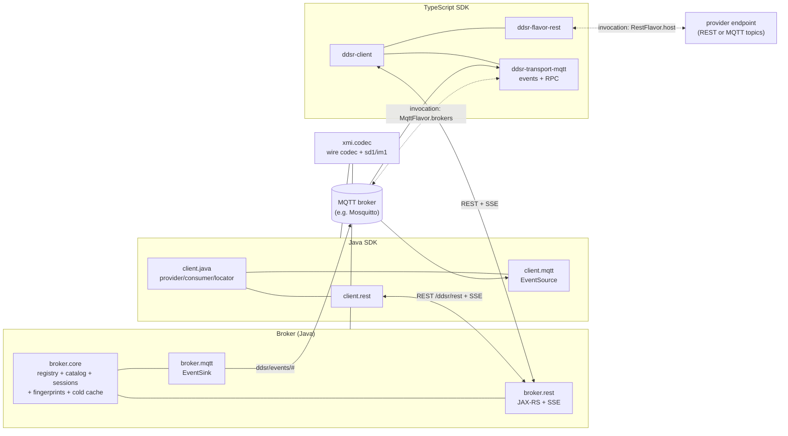
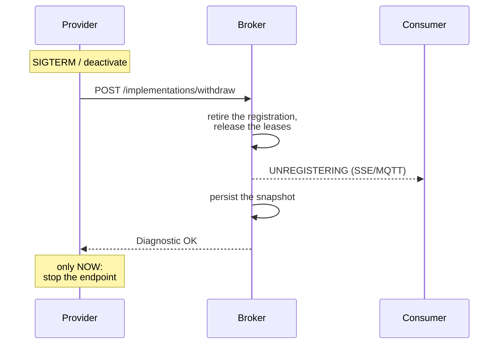
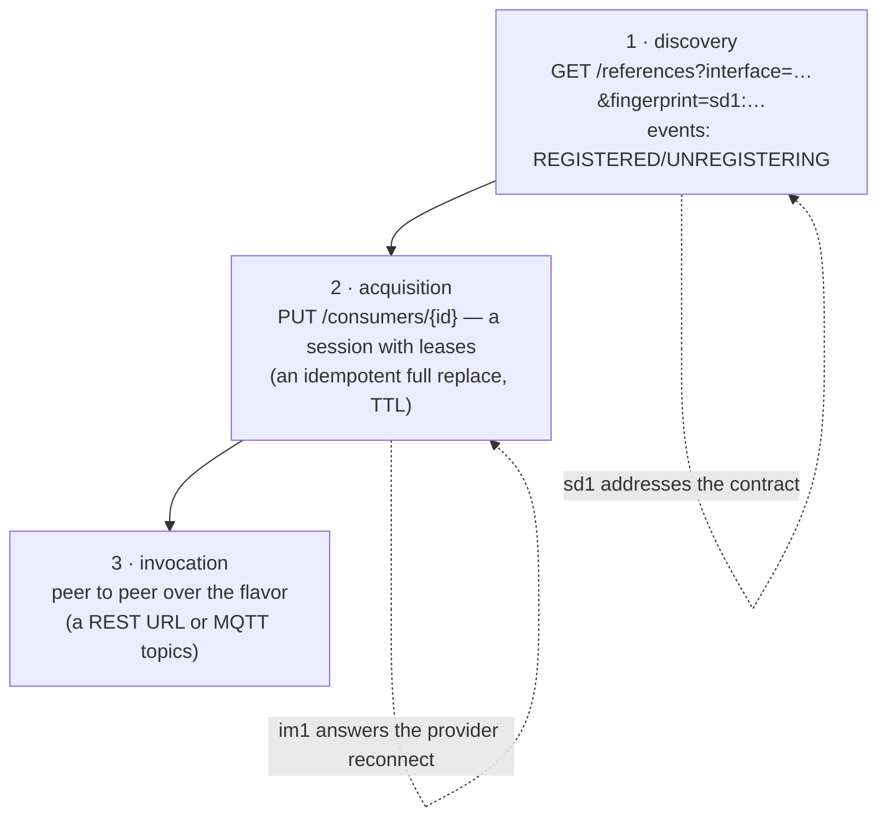

# Eclipse Fennec Services (working name DDSR) — architecture (state of the prototype iteration)

A snapshot of the state after the cross-language demo. It complements
`CLIENT_FRAMEWORK_GUIDE.md` and `REQUIREMENTS.md` — where those two
contradict it, this document wins.

---

## 0. Overview (diagrams)

The component view — the broker is discovery + acquisition, the
invocation runs peer to peer over the announced flavor:



The lifecycle guarantee (FR-P3): consumers are told **before** the
provider endpoint disappears — the shutdown blocks on the broker's
acknowledgement:



The three usage stages and where fingerprints take hold
(details: ACQUISITION.md, FINGERPRINTS.md):



---

## 1. Bundle layout

```
org.eclipse.fennec.services.model               # ecore-generated model classes
                                   #   - NamedElement.name: no longer iD
                                   #     (cross-refs run positionally)
                                   #   - ServiceReference.id: stays iD (UUID)

org.eclipse.fennec.services.broker.api          # the API ONLY (#105): a launch that
                                   #   only talks TO a broker takes this bundle
                                   #   and does not get a broker with it

org.eclipse.fennec.services.shutdown            # one component: a clean framework stop
                                   #   on SIGTERM. Into every launch; it used to sit
                                   #   in broker.core and worked there by accident

org.eclipse.fennec.services.broker.core         # the broker itself
                                   #   role interfaces:
                                   #     BrokerCatalog
                                   #     BrokerImplementations
                                   #     BrokerLookup
                                   #   DdsrBroker = composite, extends all three
                                   #   DdsrBrokerImpl: a facade, construction
                                   #     and delegation only (#110)
                                   #   behind it, one concern each:
                                   #     BrokerState    registry, lock, snapshot
                                   #     Registrations  publish/modify/withdraw
                                   #     CatalogStore   governance + resolution
                                   #     Lookups        who serves this interface
                                   #     UpdatePolicies supersession, drain, cutover
                                   #     Liveness       leases, heartbeat, sweep
                                   #     Sessions       acquisitions (never persisted)
                                   #     ColdCache      parked registrations
                                   #     Announcements  access to the EventSink
                                   #   Retirement / Republication: the two seams
                                   #     over which the concerns call each other

org.eclipse.fennec.services.broker.rest         # JAX-RS endpoints
                                   #   /catalog and /implementations are NOT
                                   #     hand-served any more: two configurations
                                   #     of the generic distribution serve them
                                   #     out of resources/broker-*-api.xmi (#76)
                                   #   the full endpoint table: WIRE_FORMAT.md
                                   #   /catalog, /catalog/{name}[?fingerprint=],
                                   #     /catalog/{name}/deprecate
                                   #   /implementations (publish),
                                   #     /implementations/withdraw (POST — canonical, D15)
                                   #   /references?interface=&filter=&flavors=&consumerId=&fingerprint=
                                   #   /consumers/{id} (sessions, PUT/GET/DELETE)
                                   #   /events (SSE; heartbeat PID
                                   #     org.eclipse.fennec.services.broker.rest.sse)
                                   #   /registry
                                   #   BrokerSelfPublisher: reads the three
                                   #     API documents, puts every contract into
                                   #     the catalog and publishes the
                                   #     implementation — no flavor in code any more
                                   #   /references is generic too since #88: the
                                   #     rule for what travels with an answer
                                   #     makes a multi-root answer describable,
                                   #     and BrokerLookupRest is the adapter with
                                   #     the signature the contract states
                                   #   EventsResource stays hand-written: SSE is
                                   #     not a call

org.eclipse.fennec.services.xmi.codec           # shared: server and client side
                                   #   XmiCodec (CSO<ResourceSet>)
                                   #   XmiBundle (multi-root wrapper)
                                   #   XmiMessageBodyReader/Writer (EObject)
                                   #   XmiBundleMessageBodyReader/Writer
                                   #   DS components with constructor injection
                                   #   → broker.rest uses them as whiteboard
                                   #     extensions, client.rest as manually
                                   #     registered Jakarta client providers

org.eclipse.fennec.services.client.java         # the transport-agnostic SDK
                                   #   DdsrClient/Provider/Consumer/Registration
                                   #   ServiceLocator + ServiceInvoker + ServiceProxyFactory
                                   #   references the three role interfaces
                                   #   via @Reference(target="(ddsr.broker.transport=rest)")

org.eclipse.fennec.services.client.rest         # the REST flavor
                                   #   RestTransport (Jakarta client + ClientBuilder
                                   #     from osgitech.rest 1.2.3)
                                   #   CatalogHttpProxy / ImplementationsHttpProxy /
                                   #     LookupHttpProxy implement the role
                                   #     interfaces as HTTP proxies
                                   #   RestServiceInvoker: the reflective wire call
                                   #   ReflectiveServiceProxyFactory: java.lang.reflect.Proxy

org.eclipse.fennec.services.flavor.rest         # shared: the placement rules
                                   #   RestPlacement: where an argument goes
                                   #   RestArguments: where it comes back from
                                   #   RestRoute: which operation a request means
                                   #   NO JAX-RS: the same rule holds for the
                                   #     consumer, the dispatcher and the template

org.eclipse.fennec.services.provider.rest       # the generic REST distribution (#84)
                                   #   GenericRestDistribution: one Application per
                                   #     configured implementation, factory PID
                                   #     org.eclipse.fennec.services.provider.rest
                                   #   RestDispatcher: @Path("{path:.*}") per verb,
                                   #     decides in model terms and calls
                                   #     reflectively
                                   #   with publish=true it is also the headless
                                   #     provider: one configuration and one
                                   #     service, no code

org.eclipse.fennec.services.rsa                 # OSGi Remote Service Admin on DDSR (#24)
                                   #   the core knows two SPIs and no transport:
                                   #     FlavorDistribution  (make reachable)
                                   #     ServiceDiscovery    (announce, listen)
                                   #   chosen through RSA config types
                                   #   registry/: a local service registry on the
                                   #     EObject registry (emf.osgi); contracts from
                                   #     a bundle capability or derived, and after
                                   #     that indistinguishable

org.eclipse.fennec.services.rsa.distribution.rest  # fennec.rest: derive a flavor,
                                   #   serve it generically (provider.rest)
org.eclipse.fennec.services.rsa.discovery.rest     # the broker + SSE as discovery
                                   #   EndpointBridge: foreign EndpointDescriptions
                                   #     as the contract osgi.rsa.endpoint via the broker
org.eclipse.fennec.services.rsa.discovery.local    # an extender per 122.6.2: endpoints from
                                   #   a bundle's remote-service header
org.eclipse.fennec.services.rsa.topology           # exports whatever asks for it, imports
                                   #   whatever is being waited for and whatever a
                                   #   discovery reports; policy / import.policy =
                                   #   promiscuous|manual
org.eclipse.fennec.services.rsa.config             # one configuration per role instead of
                                   #   nine per deployment: PID …rsa.provider or
                                   #   …rsa.consumer; it derives, checks before the
                                   #   start, writes from the inside out and tears
                                   #   down in the other direction (#109)

org.eclipse.fennec.services.rsa.tck                # the OSGi RSA TCK 8.1.0 (Central) as a launch
                                   #   against the four bundles (#99); the broker runs
                                   #   outside: itest/run-tck.sh

org.eclipse.fennec.services.examples.rsa     # a simple OSGi service, exported
                                    #   with no contract document, flavor, publisher

org.eclipse.fennec.services.examples.payment # the demo Java provider
                                    #   PaymentResource (JAX-RS on 9091)
                                    #   PaymentPublisher: addCatalogEntry + publish
                                    #   BindingProbe: none of that — the contract is
                                    #     in the model, served and published by
                                    #     provider.rest
                                    #   Its own launch: payment-provider.bndrun
```

Demo classes in `client.java/internal/` (they go away once code
generation is here):
- `BrokerCatalogRemote` + `BrokerCatalogProxyRegistrar`
- `PaymentRemote` + `PaymentProxyRegistrar` (registers one proxy per
  provider with the property `ddsr.provider.name=<name>`)
- `ClientRoundtripDebug` (exercises `BrokerCatalogRemote.listCatalog()`)
- `PaymentDebug` (against `payments-java`)
- `TsPaymentDebug` (against `payments-ts`)

---

## 2. Architectural decisions

### 2.1 A role-interface split instead of a monolithic `DdsrBroker`

`broker.core` exports four services: `DdsrBroker` (the composite) plus
the three slices `BrokerCatalog`, `BrokerImplementations`,
`BrokerLookup`. Consumers reference only the slice they need — and can
pick between the in-process broker and the HTTP proxy through the
`(ddsr.broker.transport=rest|embedded)` property while they are at it.

### 2.2 Embedded vs. remote = one service property

Both sides export the same three interfaces:
- `broker.core/DdsrBrokerComponent` → with no extra property (embedded)
- `client.rest/CatalogHttpProxy` etc. → `ddsr.broker.transport=rest`

`client.java/DdsrClientComponent` and the publishers target
`(ddsr.broker.transport=rest)` deterministically — no ambiguity,
whether the broker runs in the same runtime (the package export is
needed for the interfaces) or remotely.

### 2.3 XMI as the wire format, EMF rules everywhere

`xmi.codec` is the only layer that translates XMI ↔ EObject.
`ComponentServiceObjects<ResourceSet>` from emf.osgi hands out a
configured prototype RS per call; the helper gives it back on
`ungetService`. That way the codec works both in DS-managed form (the
server whiteboard) and as an instance (the client registers it on the
Jakarta client).

### 2.4 The catalog URL as the canonical SI reference

`impl.serviceInterfaces` is **not** sent with an SI sibling in the
publish body but as a cross-document `href` onto the broker URL:

```xml
<implementations …>
  <serviceInterfaces href="http://192.168.1.6:8887/ddsr/rest/catalog/Payment"/>
  <flavors xsi:type="services:RestFlavor" host="…" basePath="…">
    <operationFlavors name="charge" method="POST" path="/charge">
      <operation href="http://192.168.1.6:8887/ddsr/rest/catalog/Payment#//@operations.0"/>
    </operationFlavors>
  </flavors>
</implementations>
```

The publisher puts `paymentApi` into a `Resource` with the URI
`<brokerUrl>/catalog/<name>` — EMF then emits the cross-refs as hrefs
by itself. The broker recognises EMF proxies (`eIsProxy()`), reads the
catalog name out of the URI path and the operation index out of the
fragment (`//@operations.N`) **without an HTTP fetch**, and rewires
onto the live catalog entries.

The trade-off: the publisher needs the broker URL (the config attribute
`broker.url`). The result: the publish body shrinks by the size of the
SI, and it is conceptually clean (the catalog is the source, the impl
references it).

### 2.5 A reflective proxy + ServiceInvoker instead of code generation

The entry skeleton for the stubs to be generated later:

```java
public interface PaymentRemote {
    double getBalance(String accountId);
    double charge(double amount, String currency);
}
```

Hand-written. The `ReflectiveServiceProxyFactory` builds a
`java.lang.reflect.Proxy` at runtime that translates every method call
into `ServiceInvoker.invoke(locator, method.getName(), argsMap)`.

**Argument names come from the model**, not from Java reflection: the
proxy fetches `ServiceLocator → RestFlavor → OperationFlavor →
ServiceOperation → Parameter[].name` and maps `args[i] →
modelParameterNames.get(i)` positionally. That works **independently of
the `-parameters` compile flag** and follows the model as the truth.

The wire convention in `RestServiceInvoker`:
- `GET` → args as query params
- `POST`/`PUT`/`DELETE` with one EObject arg → an XMI body
- `POST`/`PUT`/`DELETE` with primitive/string args → query params, no body
- the Accept header from `RestOperationFlavor.produces[0]`
- return coercion: `application/xml` → EObject; otherwise a String with
  primitive parsing (`Double.parseDouble` etc.) in the proxy

### 2.6 Idempotence and dedup in the broker

On the broker side (`DdsrBrokerImpl.publishImplementation`):

1. **SI validation**: pull the name out of the EObject or the proxy URI
   and match it against the `catalog`.
2. **Provider dedup** (`findProviderByNameVersion`): if a provider with
   the same `(name, version)` exists it is reused; the new impl is hung
   into it by containment.
3. **Impl dedup, new** (`findImplementationByNameVersion`): if an impl
   with the same `(name, version)` exists, the old one is retired via
   `retireImplementation` (out of the provider, out of
   `registry.implementations`, out of the `implByRegistration` map, plus
   `lookup.serviceRemoved`) before the new one is inserted.
4. **Operation rewire**: the flavor's `operation` refs are mapped onto
   live catalog operations (either through the resolved ref or through
   the proxy URI fragment `//@operations.N`).

5. **Modify instead of republish** (`modifyImplementation`, `PUT
   /implementations`, #55): if only *what is registered* changes (the
   endpoint, properties, capabilities, description, the policy knobs)
   and not the contract, the live registration is updated in place —
   the same reference id, every lease survives, the reference
   decoration (im1, properties) is refreshed, and consumers get
   `MODIFIED`. A contract change (different `(name, sd1)` entries) is
   refused with code 214; that is a publish, optionally with
   `replaces`. The SDKs use modify for row 2 of the reconnect check
   (sd1 equal, im1 different) and offer it as `Registration.update()`.

That way publishes survive restarts without accumulating, and lookups
return exactly one reference per `(provider, impl)` combination.

### 2.7 Persistence and rehydration

`broker-state.xmi` holds everything: the catalog, providers as sibling
roots, impls as containment children of the providers. At startup
`DdsrBrokerImpl` reads the file. `reindex()` walks every
`ServiceImplementation` in `registry.implementations` and creates fresh
`ServiceReference`+`ServiceRegistration` pairs (with new UUIDs — refs
are not stable across restarts, a consumer has to look up again). The
lookup backend is reindexed.

### 2.8 A Diagnostic instead of an HTTP exception

All the HTTP proxies (`CatalogHttpProxy`, `ImplementationsHttpProxy`)
use `.post(entity)` / `.delete()` **without a typed class**, read the
response by hand and parse the body as a `Diagnostic` whatever the HTTP
status is. That lets a 4xx with a Diagnostic body (e.g.
`code=202 CATALOG_ENTRY_ALREADY_EXISTS`) through cleanly — callers can
inspect `severity` and `code` instead of catching a
`ClientErrorException`.

---

## 3. Wire examples

### 3.1 Self-publish (the broker registers itself)

In process — no wire. The `BrokerSelfPublisher` puts three
ServiceInterfaces (`BrokerCatalog`, `BrokerImplementations`,
`BrokerLookup`) into the catalog and publishes the provider
`ddsr-broker` with a RestFlavor `host=<the public.url authority>`,
`basePath=<the public.url path>`.

### 3.2 A remote publish (`PaymentPublisher` → broker)

The wire body of `POST /implementations`:

```xml
<?xml version="1.0" encoding="UTF-8"?>
<services:ServiceProvider name="payments-java" version="1.0.0"
                      symbolicName="org.eclipse.fennec.services.examples.payment">
  <implementations name="payments-java-rest" version="1.0.0"
                   description="Java reference Payment implementation">
    <serviceInterfaces href="http://192.168.1.6:8887/ddsr/rest/catalog/Payment"/>
    <flavors xsi:type="services:RestFlavor" name="payments-java-rest"
             host="http://192.168.1.6:9091" basePath="/payments">
      <operationFlavors name="charge" method="POST" path="/charge">
        <operation href="http://192.168.1.6:8887/ddsr/rest/catalog/Payment#//@operations.0"/>
        <produces>application/json</produces>
      </operationFlavors>
      <operationFlavors name="getBalance" path="/balance">
        <operation href="http://192.168.1.6:8887/ddsr/rest/catalog/Payment#//@operations.1"/>
        <produces>application/json</produces>
      </operationFlavors>
      <contentTypes>application/json</contentTypes>
    </flavors>
  </implementations>
</services:ServiceProvider>
```

### 3.3 The lookup response (`GET /references?interface=Payment`)

Multi-root with a `LocalServiceRegistry` envelope (refs + the provider
tree by containment) plus the referenced ServiceInterfaces as sibling
roots. The siblings are not listed anywhere: they are what the answer
references and nobody else owns, which is the rule of #88 — see
[What travels with an answer](WIRE_FORMAT.md#what-travels-with-an-answer).
The shape keeps the cross-references intra-document.

### 3.4 A cross-language call

```
Java client                            TS server (192.168.1.5:9090)
  payment.charge(10.0, "EUR")  ←→
    │
    ↓ (java.lang.reflect.Proxy)
  RestServiceInvoker
    op = RestOperationFlavor "charge" (POST /charge, produces=json)
    args from model: [amount, currency]
    accept = application/json
    target = http://192.168.1.5:9090/payments
  HTTP POST /payments/charge?amount=10.0&currency=EUR
                                            ──→ TS PaymentResource.charge
                                            ←── 200 application/json "990.0"
    body = "990.0"
    coerceReturn(double, "990.0") = 990.0d
  return 990.0
```

The same pattern for the Java provider, only a different `host` in the
locator.

### 3.5 The envelope: every message is a CloudEvent (#101)

Since #101 a lifecycle event, a call and an answer all travel in a
CloudEvents 1.0 envelope. Structured mode (JSON event format) where the
transport carries nothing but messages — SSE frames, MQTT, AMQP when it
comes — and binary mode over HTTP, where the attributes are `ce-*`
headers and the body stays exactly the payload its contract declares.

That split is why REST did not change and MQTT did: HTTP has headers
and MQTT does not, which is precisely the reason both modes exist in
the specification.

The envelope carries what the message itself deliberately does not.
`ServiceInvocation`'s own documentation says it: *correlation and the
reply address belong to the envelope, not here.* CloudEvents defines
neither, and MQTT 3.1.1 cannot supply them either, so both travel as
extension attributes — `replyto` and `correlationid`.

The full attribute table is in [WIRE_FORMAT.md](WIRE_FORMAT.md); the
Java side is `org.eclipse.fennec.services.cloudevents` over the
`io.cloudevents.model` ecore, the TypeScript side `cloud-events.ts` in
`@ddsr/client`.

### 3.6 MQTT invocation: request/response over topics

Frozen with the TypeScript reference implementation
(`ddsr-transport-mqtt/src/mqtt-rpc.ts`). A call is two events:

```
request topic:   MqttOperationFlavor.requestTopic,
                 otherwise <MqttFlavor.requestTopic>/<operation.name>
reply topic:     chosen by the CONSUMER: <base>/<request id> with
                 base = MqttOperationFlavor.responseTopic
                      | MqttFlavor.responseTopic
                      | <requestTopic>/reply
request:         CloudEvent, type …invoke, replyto = the reply topic,
                 data = a ServiceInvocation document
response:        CloudEvent, type …invoke.reply,
                 correlationid = the request's id,
                 data = a ServiceInvocationResult document
QoS:             MqttOperationFlavor.qos | MqttFlavor.defaultQos
                 | AT_LEAST_ONCE;   retained: never
```

The payload is the model: one `Argument` per value in the `Property`
that fits its declared type, so an `int` stays an `int` and a modelled
argument travels inside the message (`EObjectProperty` contains its
value). The document is self-contained — it carries a copy of the
operation being called, so the references from the invocation to its
operation and parameters resolve inside it.

One reply topic per request: the subscription never sees somebody
else's answer, and `correlationid` double-checks. The DDSR broker takes
no part in the invocation — discovery/acquisition only (ACQUISITION.md
§1); the MQTT broker's address comes from `MqttFlavor.brokers`, exactly
like `RestFlavor.host` on the REST path. A handler error answers with a
`Diagnostic` instead of leaving the consumer to time out.

TypeScript on both ends: the MQTT call path has only ever existed
there. Java carries the events over MQTT but not the calls; its
counterpart arrives with #98.

---

## 4. Configuration

Currently wired to LAN IPs:

| Bundle | PID | Attribute | Value |
|---|---|---|---|
| broker.rest | `org.eclipse.fennec.services.broker.rest` | `public.url` | `http://192.168.1.6:8887/ddsr/rest` |
| broker.rest | `org.apache.felix.http~ddsrHttp` | port / host | `8887` / `0.0.0.0` |
| client.rest | `org.eclipse.fennec.services.client.rest` | `broker.url` | `http://192.168.1.6:8887/ddsr/rest` |
| client.java | `org.eclipse.fennec.services.client` | `supported.flavors`, `consumer.id` | `REST`, — |
| example.payment | `org.eclipse.fennec.services.examples.payment` | `public.url`, `broker.url`, `provider.name` | `http://192.168.1.6:9091/payments`, `http://192.168.1.6:8887/ddsr/rest`, `payments-java` |
| example.payment | `org.apache.felix.http~paymentsHttp` | port / context | `9091` / `payments` |
| provider.rest | `org.eclipse.fennec.services.provider.rest~<name>` (factory) | `ddsr.contract`, `service.filter`, `model.bundle`, `model.entry`, `osgi.jakartars.application.base` | one distribution per contract |
| provider.rest | the same factory PID | `publish`, `public.url`, `broker.url` | with `publish=true` it also publishes itself |

The three broker values (`public.url`, port, host) are no longer
hard-wired in `broker.rest/configs/config.json` but are
`$[env:...]` placeholders with exactly these defaults, resolved by
`org.apache.felix.configadmin.plugin.interpolation` (enforced in the
launch through `felix.cm.config.plugins`, so that no configuration is
delivered before the plugin is there). That makes `DDSR_PUBLIC_URL` /
`DDSR_HTTP_PORT` / `DDSR_HTTP_HOST` configure the same launch on the
host as in the container — see [DEPLOYMENT.md](DEPLOYMENT.md).

---

## 5. Open points

| Topic | Status |
|---|---|
| Model: possibly put iD back on selected classes (ServiceInterface, ServiceProvider) — if global uniqueness is wanted | open |
| The `/registry` response: providers as sibling roots (instead of cross-document hrefs) | done (the XmiBundle pattern, and since #88 a rule rather than a hand-written answer) |
| Operation / parameter marshalling for complex payloads (e.g. a nested DTO as JSON or XMI) | partly — the generic distribution reads a body by the type the contract declares (EClass → XMI, otherwise text); there is no JSON |
| Ordering in the headless provider: the publish goes out before the whiteboard has mounted the application, and on deactivation the endpoint dies before the withdraw (DS takes the service away before `deactivate`) | open — whoever needs FR-P3 publishes from a component of their own |
| Service health / reachability probing in the client (filtering dead locators) | open — today `PaymentProxyRegistrar` picks every provider, callers filter via `ddsr.provider.name` |
| A code generator for service stubs (`PaymentRemote` style) out of the catalog | open |
| A wire convention for POST/PUT with mixed EObject + primitive args | open |
| SSE / an event stream for a ServiceListener model | open |
| Activating OCL / constraint validation in the model | open |
| A cleanup pass in `reindex` for persisted duplicates from older versions | open (a manual `rm broker-state.xmi` is enough for now) |

---

## 6. Reproducing the demo

1. **Start the broker**: `broker.bndrun` from
   `org.eclipse.fennec.services.broker.rest` in Eclipse, or
   `./gradlew :org.eclipse.fennec.services.broker.rest:run.broker`.
   It listens on `http://192.168.1.6:8887/ddsr/rest` and self-publishes
   its three broker APIs.

2. **Start the Java payment provider**: `payment-provider.bndrun` from
   `org.eclipse.fennec.services.examples.payment`. It listens on
   `http://192.168.1.6:9091/payments` and publishes the Payment catalog
   entry plus the provider `payments-java` automatically on activate.

3. **Optionally the TS payment provider**: a colleague on
   `192.168.1.5:9090`, open your own firewall
   (`firewall-cmd --add-port=9090/tcp`), the same catalog entry
   `Payment` v1.0.0.

4. **Start the client**: `client.bndrun` from
   `org.eclipse.fennec.services.client.java`. What to expect in the log:
   - `BrokerCatalogRemote.listCatalog()` → 4 catalog entries
   - `PaymentDebug.payment.getBalance("42")` against the Java provider →
     `STARTING_BALANCE`
   - `TsPaymentDebug.ts.getBalance("account-1")` against the TS provider →
     its balance
   - `ts.charge(10.0, "EUR")` → the new balance
