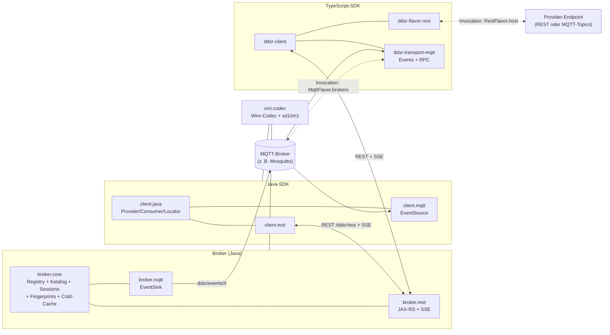
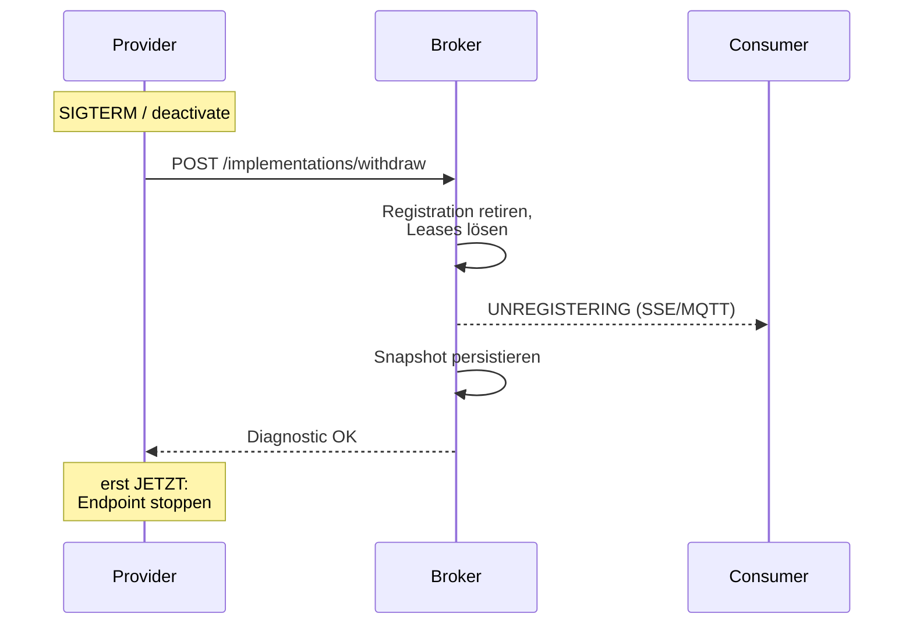
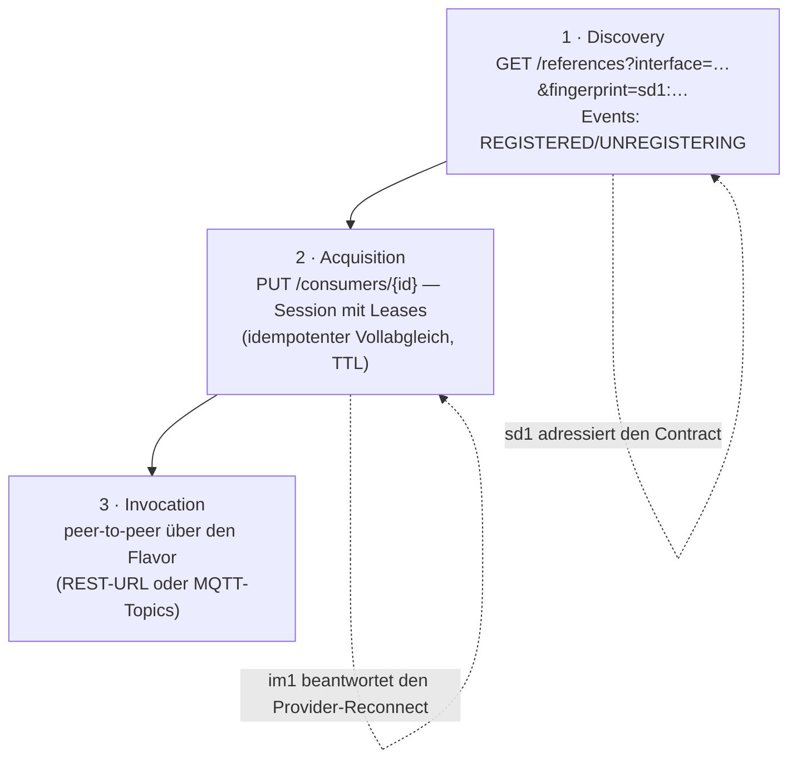

# Eclipse Fennec Services (Arbeitsname DDSR) — Architektur (Stand der Prototyp-Iteration)

Schnappschuss vom Stand nach der Cross-Language-Demo. Ergänzt
`CLIENT_FRAMEWORK_GUIDE.md` und `REQUIREMENTS.md` — wo die beiden
sich widersprechen, gilt dieses Dokument.

---

## 0. Überblick (Diagramme)

Komponentensicht — der Broker ist Discovery+Acquisition, die Invocation
läuft peer-to-peer über den annoncierten Flavor:



Lifecycle-Garantie (FR-P3): Consumer werden informiert, **bevor** der
Provider-Endpoint verschwindet — der Shutdown blockiert auf die
Broker-Bestätigung:



Die drei Nutzungsstufen und wo Fingerprints greifen
(Details: ACQUISITION.md, FINGERPRINTS.md):



---

## 1. Bundle-Layout

```
org.eclipse.fennec.services.model               # ecore-generierte Modellklassen
                                   #   - NamedElement.name: KEIN iD mehr
                                   #     (Cross-Refs laufen positional)
                                   #   - ServiceReference.id: bleibt iD (UUID)

org.eclipse.fennec.services.broker.core         # API + In-Memory-Impl
                                   #   role-Interfaces:
                                   #     BrokerCatalog
                                   #     BrokerImplementations
                                   #     BrokerLookup
                                   #   DdsrBroker = composite extends alle drei
                                   #   DdsrBrokerImpl: state + XMI-Persistenz

org.eclipse.fennec.services.broker.rest         # JAX-RS-Endpoints
                                   #   vollständige Endpoint-Tabelle: WIRE_FORMAT.md
                                   #   /catalog, /catalog/{name}[?fingerprint=],
                                   #     /catalog/{name}/deprecate
                                   #   /implementations (publish),
                                   #     /implementations/withdraw (POST — kanonisch, D15)
                                   #   /references?interface=&filter=&flavors=&consumerId=&fingerprint=
                                   #   /consumers/{id} (Sessions, PUT/GET/DELETE)
                                   #   /events (SSE; Heartbeat-PID
                                   #     org.eclipse.fennec.services.broker.rest.sse)
                                   #   /registry
                                   #   BrokerSelfPublisher: legt die drei Broker-APIs
                                   #     in den Katalog und published sich selbst

org.eclipse.fennec.services.xmi.codec           # geteilt: Server- + Client-Seite
                                   #   XmiCodec (CSO<ResourceSet>)
                                   #   XmiBundle (Multi-Root-Wrapper)
                                   #   XmiMessageBodyReader/Writer (EObject)
                                   #   XmiBundleMessageBodyReader/Writer
                                   #   DS-Components mit constructor-injection
                                   #   → broker.rest nutzt sie als Whiteboard-
                                   #     Extensions, client.rest als manuell
                                   #     registrierte Jakarta-Client-Providers

org.eclipse.fennec.services.client.java         # transport-agnostische SDK
                                   #   DdsrClient/Provider/Consumer/Registration
                                   #   ServiceLocator + ServiceInvoker + ServiceProxyFactory
                                   #   referenziert die drei role-Interfaces
                                   #   via @Reference(target="(ddsr.broker.transport=rest)")

org.eclipse.fennec.services.client.rest         # REST-Flavor
                                   #   RestTransport (Jakarta Client + ClientBuilder
                                   #     aus osgitech.rest 1.2.3)
                                   #   CatalogHttpProxy / ImplementationsHttpProxy /
                                   #     LookupHttpProxy implementieren die
                                   #     role-Interfaces als HTTP-Proxies
                                   #   RestServiceInvoker: reflective wire-call
                                   #   ReflectiveServiceProxyFactory: java.lang.reflect.Proxy

org.eclipse.fennec.services.examples.payment # Demo-Java-Provider
                                    #   PaymentResource (JAX-RS auf 9091)
                                    #   PaymentPublisher: addCatalogEntry + publish
                                    #   Eigene Launch: payment-provider.bndrun
```

Demo-Klassen in `client.java/internal/` (gehen weg, sobald Codegen
da ist):
- `BrokerCatalogRemote` + `BrokerCatalogProxyRegistrar`
- `PaymentRemote` + `PaymentProxyRegistrar` (registriert pro Provider
  einen Proxy mit Property `ddsr.provider.name=<name>`)
- `ClientRoundtripDebug` (testet `BrokerCatalogRemote.listCatalog()`)
- `PaymentDebug` (gegen `payments-java`)
- `TsPaymentDebug` (gegen `payments-ts`)

---

## 2. Architektur-Entscheidungen

### 2.1 Role-Interface-Splitt statt Mono-`DdsrBroker`

`broker.core` exportiert vier Services: `DdsrBroker` (composite) plus
die drei Slices `BrokerCatalog`, `BrokerImplementations`,
`BrokerLookup`. Consumer referenzieren nur die Slice, die sie
brauchen — und können dabei via `(ddsr.broker.transport=rest|embedded)`
Property zwischen In-Process-Broker und HTTP-Proxy wählen.

### 2.2 Embedded vs. Remote = nur eine Service-Property

Beide Seiten exportieren dieselben drei Interfaces:
- `broker.core/DdsrBrokerComponent` → ohne extra Property (embedded)
- `client.rest/CatalogHttpProxy` etc. → `ddsr.broker.transport=rest`

`client.java/DdsrClientComponent` und die Publisher targeten
deterministisch `(ddsr.broker.transport=rest)` — keine Mehrdeutigkeit,
egal ob der Broker im gleichen Runtime mitläuft (Package-Export wird
gebraucht für die Interfaces) oder remote ist.

### 2.3 XMI als Wire-Format, EMF rules everywhere

`xmi.codec` ist die einzige Schicht, die XMI ↔ EObject übersetzt.
`ComponentServiceObjects<ResourceSet>` aus emf.osgi liefert pro Call
eine konfigurierte Prototype-RS; der Helper gibt sie nach
`ungetService` zurück. Damit funktioniert das Codec sowohl in
DS-managed Form (Server-Whiteboard) als auch als Instanz (Client
registriert auf Jakarta-Client).

### 2.4 Catalog-URL als kanonische SI-Referenz

`impl.serviceInterfaces` wird **nicht** mit einem SI-Sibling im Publish-
Body geschickt, sondern als cross-doc `href` auf die Broker-URL:

```xml
<implementations …>
  <serviceInterfaces href="http://192.168.1.6:8887/ddsr/rest/catalog/Payment"/>
  <flavors xsi:type="services:RestFlavor" host="…" basePath="…">
    <operationFlavors name="charge" method="POST" path="/charge">
      <operation href="http://192.168.1.6:8887/ddsr/rest/catalog/Payment#//@operations.0"/>
    </operationFlavors>
  </flavors>
</implementations>
```

Publisher legt `paymentApi` in eine `Resource` mit URI =
`<brokerUrl>/catalog/<name>` ab — EMF emittiert die Cross-Refs dann
automatisch als href. Broker erkennt EMF-Proxies (`eIsProxy()`),
liest Catalog-Namen aus dem URI-Path und Operation-Index aus dem
Fragment (`//@operations.N`) **ohne HTTP-Fetch** und rewired auf
die lebenden Catalog-Einträge.

Trade-off: Publisher braucht die Broker-URL (Config-Attribute
`broker.url`). Ergebnis: Publish-Body schrumpft um die Größe der
SI; konzeptionell sauber (Catalog ist die Quelle, Impl referenziert).

### 2.5 Reflective Proxy + ServiceInvoker statt Codegen

Eingangsskelett für später-zu-generierende Stubs:

```java
public interface PaymentRemote {
    double getBalance(String accountId);
    double charge(double amount, String currency);
}
```

Hand-geschrieben. Der `ReflectiveServiceProxyFactory` baut zur Laufzeit
einen `java.lang.reflect.Proxy`, der jeden Methodencall in
`ServiceInvoker.invoke(locator, method.getName(), argsMap)` übersetzt.

**Argument-Namen kommen aus dem Modell**, nicht aus Java-Reflection:
der Proxy holt sich `ServiceLocator → RestFlavor → OperationFlavor →
ServiceOperation → Parameter[].name` und mappt positionally
`args[i] → modelParameterNames.get(i)`. Damit funktioniert das
**unabhängig vom `-parameters`-Compile-Flag** und folgt dem Modell als
Wahrheit.

Wire-Konvention im `RestServiceInvoker`:
- `GET` → Args als Query-Params
- `POST`/`PUT`/`DELETE` mit einem EObject-Arg → XMI-Body
- `POST`/`PUT`/`DELETE` mit primitive/string Args → Query-Params, kein Body
- Accept-Header aus `RestOperationFlavor.produces[0]`
- Return-Coercion: `application/xml` → EObject; sonst String mit
  primitive-Parsing (`Double.parseDouble` etc.) im Proxy

### 2.6 Idempotenz und Dedup im Broker

Auf der Broker-Seite (`DdsrBrokerImpl.publishImplementation`):

1. **SI-Validierung**: Name aus EObject oder Proxy-URI ziehen,
   gegen `catalog` matchen.
2. **Provider-Dedup** (`findProviderByNameVersion`): existiert
   Provider mit gleichem `(name, version)`, wird er wiederverwendet;
   neue Impl wird per Containment dort eingehängt.
3. **Impl-Dedup neu** (`findImplementationByNameVersion`):
   existiert Impl mit gleichem `(name, version)`, wird die alte
   per `retireImplementation` abgemeldet (aus Provider, aus
   `registry.implementations`, aus `implByRegistration`-Map, plus
   `lookup.serviceRemoved`) bevor die neue eingefügt wird.
4. **Operation-Rewire**: Flavor-`operation`-Refs werden auf live
   Catalog-Operations gemappt (entweder via aufgelöster Ref oder
   Proxy-URI-Fragment `//@operations.N`).

Damit überleben Publishes Restarts ohne Akkumulation, und Lookups
returnen genau eine Reference pro `(provider, impl)`-Kombination.

### 2.7 Persistenz und Rehydration

`broker-state.xmi` enthält alles: Catalog, Provider als Sibling-
Roots, Impls als Containment-Children der Provider. Beim Start
liest `DdsrBrokerImpl` das File ein. `reindex()` läuft über jede
`ServiceImplementation` in `registry.implementations` und erzeugt
frische `ServiceReference`+`ServiceRegistration`-Paare (mit neuen
UUIDs — Refs sind nicht stabil über Restarts, Consumer muss
re-look-upen). Lookup-Backend wird neu indexiert.

### 2.8 Diagnostic statt HTTP-Exception

Alle HTTP-Proxies (`CatalogHttpProxy`, `ImplementationsHttpProxy`)
nutzen `.post(entity)` / `.delete()` **ohne typed Class**, lesen den
Response manuell und parsen den Body als `Diagnostic` egal welcher
HTTP-Status. Damit kommen 4xx mit Diagnostic-Body (z. B.
`code=202 CATALOG_ENTRY_ALREADY_EXISTS`) sauber durch — Caller
können `severity` und `code` inspizieren statt `ClientErrorException`
zu fangen.

---

## 3. Wire-Beispiele

### 3.1 Self-Publish (Broker registriert sich selbst)

In-Process — kein Wire. Der `BrokerSelfPublisher` legt drei
ServiceInterfaces (`BrokerCatalog`, `BrokerImplementations`,
`BrokerLookup`) in den Catalog und published den Provider
`ddsr-broker` mit RestFlavor `host=<public.url-Authority>`,
`basePath=<public.url-Path>`.

### 3.2 Remote Publish (`PaymentPublisher` → Broker)

Wire-Body Post `/implementations`:

```xml
<?xml version="1.0" encoding="UTF-8"?>
<services:ServiceProvider name="payments-java" version="1.0.0"
                      symbolicName="org.eclipse.fennec.services.examples.payment">
  <implementations name="payments-java-rest" version="1.0.0"
                   description="Java reference Payment implementation">
    <serviceInterfaces href="http://192.168.1.6:8887/ddsr/rest/catalog/Payment"/>
    <flavors xsi:type="services:RestFlavor" name="payments-java-rest"
             host="http://192.168.1.6:9091" basePath="/payments">
      <operationFlavors name="charge" method="POST" path="/charge">
        <operation href="http://192.168.1.6:8887/ddsr/rest/catalog/Payment#//@operations.0"/>
        <produces>application/json</produces>
      </operationFlavors>
      <operationFlavors name="getBalance" path="/balance">
        <operation href="http://192.168.1.6:8887/ddsr/rest/catalog/Payment#//@operations.1"/>
        <produces>application/json</produces>
      </operationFlavors>
      <contentTypes>application/json</contentTypes>
    </flavors>
  </implementations>
</services:ServiceProvider>
```

### 3.3 Lookup-Response (`GET /references?interface=Payment`)

Multi-Root mit `LocalServiceRegistry`-Envelope (Refs + Provider-
Tree als Containment) plus den referenzierten ServiceInterfaces als
Sibling-Roots — siehe LookupResource. Diese Form behält die
Cross-Refs intra-document.

### 3.4 Cross-Language-Call

```
Java-Client                            TS-Server (192.168.1.5:9090)
  payment.charge(10.0, "EUR")  ←→
    │
    ↓ (java.lang.reflect.Proxy)
  RestServiceInvoker
    op = RestOperationFlavor "charge" (POST /charge, produces=json)
    args from model: [amount, currency]
    accept = application/json
    target = http://192.168.1.5:9090/payments
  HTTP POST /payments/charge?amount=10.0&currency=EUR
                                            ──→ TS PaymentResource.charge
                                            ←── 200 application/json "990.0"
    body = "990.0"
    coerceReturn(double, "990.0") = 990.0d
  return 990.0
```

Selbes Pattern für Java-Provider, nur andere `host` im Locator.

### 3.x MQTT-Invocation (A2 Etappe 2): Request/Response über Topics

Eingefroren mit der TS-Referenzimplementierung
(`ddsr-transport-mqtt/src/mqtt-rpc.ts`); MQTT 3.1.1-kompatibel — die
MQTT-5-Properties `response-topic`/`correlation-data` existieren im
paho-v3-Stack nicht, also reisen beide im Envelope:

```
Request-Topic:   MqttOperationFlavor.requestTopic,
                 sonst <MqttFlavor.requestTopic>/<operation.name>
Reply-Topic:     vom CONSUMER gewählt: <base>/<correlationId> mit
                 base = MqttOperationFlavor.responseTopic
                      | MqttFlavor.responseTopic
                      | <requestTopic>/reply
Request (JSON):  {"correlationId":"<uuid>","replyTo":"<topic>","args":{…}}
Response (JSON): {"correlationId":"<uuid>","result":<wert>}
                 | {"correlationId":"<uuid>","error":"<meldung>"}
QoS:             MqttOperationFlavor.qos | MqttFlavor.defaultQos
                 | AT_LEAST_ONCE;   retained: nie
```

Ein Reply-Topic pro Request: die Subscription sieht nie eine fremde
Antwort, die Korrelation ist trotzdem doppelt abgesichert
(correlationId im Envelope). Der DDSR-Broker ist an der Invocation
nicht beteiligt — Discovery/Acquisition only (ACQUISITION.md §1); die
Adresse des MQTT-Brokers kommt aus `MqttFlavor.brokers`, exakt wie
`RestFlavor.host` beim REST-Pfad. Handler-Fehler antworten mit dem
error-Envelope statt eines Consumer-Timeouts.

---

## 4. Konfiguration

Aktuell auf LAN-IPs verdrahtet:

| Bundle | PID | Attribute | Wert |
|---|---|---|---|
| broker.rest | `org.eclipse.fennec.services.broker.rest` | `public.url` | `http://192.168.1.6:8887/ddsr/rest` |
| broker.rest | `org.apache.felix.http~ddsrHttp` | port / host | `8887` / `0.0.0.0` |
| client.rest | `org.eclipse.fennec.services.client.rest` | `broker.url` | `http://192.168.1.6:8887/ddsr/rest` |
| client.java | `org.eclipse.fennec.services.client` | `supported.flavors`, `consumer.id` | `REST`, — |
| example.payment | `org.eclipse.fennec.services.examples.payment` | `public.url`, `broker.url`, `provider.name` | `http://192.168.1.6:9091/payments`, `http://192.168.1.6:8887/ddsr/rest`, `payments-java` |
| example.payment | `org.apache.felix.http~paymentsHttp` | port / context | `9091` / `payments` |

Die drei Broker-Werte (`public.url`, Port, Host) sind in
`broker.rest/configs/config.json` nicht mehr fest verdrahtet, sondern
`$[env:...]`-Platzhalter mit genau diesen Defaults, aufgelöst vom
`org.apache.felix.configadmin.plugin.interpolation` (im Launch über
`felix.cm.config.plugins` erzwungen, damit keine Konfiguration vor dem
Plugin ausgeliefert wird). Damit konfiguriert `DDSR_PUBLIC_URL` /
`DDSR_HTTP_PORT` / `DDSR_HTTP_HOST` denselben Launch auf dem Host wie im
Container — siehe [DEPLOYMENT.md](DEPLOYMENT.md).

---

## 5. Offene Punkte

| Thema | Status |
|---|---|
| Modell: ggf. iD wieder zurück auf gezielte Klassen (ServiceInterface, ServiceProvider) — wenn globale Eindeutigkeit gewünscht | offen |
| `/registry`-Response: Provider als Sibling-Roots (statt Cross-Doc-hrefs) | erledigt (XmiBundle-Pattern in LookupResource) |
| Operationen / Parameter-Marshalling für komplexe Payloads (z. B. nested DTO als JSON oder XMI) | offen — heute nur primitive Query-Params oder einzelne EObject als XMI-Body |
| Service-Health / Reachability-Probing im Client (filter dead locators) | offen — heute pickt `PaymentProxyRegistrar` jeden Provider, Caller filtern via `ddsr.provider.name` |
| Code-Generator für Service-Stubs (`PaymentRemote`-style) aus dem Catalog | offen |
| Wire-Konvention für POST/PUT mit gemischten EObject + primitive Args | offen |
| SSE / Event-Stream für ServiceListener-Modell | offen |
| OCL / Constraint-Validation im Modell aktivieren | offen |
| Cleanup-Pass im `reindex` für persistierte Duplikate aus älteren Versionen | offen (manueller `rm broker-state.xmi` reicht aktuell) |

---

## 6. Demo-Reproduktion

1. **Broker starten**: `broker.bndrun` aus `org.eclipse.fennec.services.broker.rest`
   in Eclipse, oder `./gradlew :org.eclipse.fennec.services.broker.rest:run.broker`.
   Hört auf `http://192.168.1.6:8887/ddsr/rest`. Self-published seine
   drei Broker-APIs.

2. **Java-Payment-Provider starten**: `payment-provider.bndrun` aus
   `org.eclipse.fennec.services.examples.payment`. Hört auf
   `http://192.168.1.6:9091/payments`. Published Payment-Catalog-
   Entry + Provider `payments-java` automatisch beim Activate.

3. **Optional TS-Payment-Provider**: Kollege auf `192.168.1.5:9090`,
   eigene Firewall öffnen (`firewall-cmd --add-port=9090/tcp`),
   gleicher Catalog-Eintrag `Payment` v1.0.0.

4. **Client starten**: `client.bndrun` aus `org.eclipse.fennec.services.client.java`.
   Erwartung im Log:
   - `BrokerCatalogRemote.listCatalog()` → 4 Catalog-Einträge
   - `PaymentDebug.payment.getBalance("42")` gegen Java-Provider →
     `STARTING_BALANCE`
   - `TsPaymentDebug.ts.getBalance("account-1")` gegen TS-Provider →
     dessen Balance
   - `ts.charge(10.0, "EUR")` → neue Balance
